# platform/argocd/

ArgoCD configuration. App-of-Apps root + AppProjects + child Applications. ArgoCD is the only CD tool; the only reconciliation source for everything in `platform/` and the manifests in `services/*/k8s/`.

## What this folder owns

- `root.yaml`: the App-of-Apps root `Application` that points at `platform/argocd/applications/`.
- `projects/`: AppProjects scoping permissions per platform area.
- `applications/`: one Application per platform component or service.
- ArgoCD Image Updater configuration (annotations on each Application).
- ArgoCD itself is also installed via Helm; the install command is in `platform/cluster/README.md` since it is part of cluster provisioning.

## Why one CD

One stack per use case. We do not pair ArgoCD with Flux. ArgoCD's App-of-Apps + Image Updater + Argo Rollouts ecosystem covers our GitOps needs.

## Install and setup

```bash
# Install ArgoCD itself (one-time per cluster, Stage 01)
helm repo add argo https://argoproj.github.io/argo-helm
helm repo update

helm upgrade --install argocd argo/argo-cd \
  --version 7.x.x \
  --namespace argocd \
  --create-namespace \
  --values platform/argocd/argocd-values.yaml

# Then apply the App-of-Apps root
kubectl apply -f platform/argocd/root.yaml
```

The root reconciles the whole tree under `applications/`.

Image Updater installs as a sidecar in the argocd namespace:

```bash
helm upgrade --install argocd-image-updater argo/argocd-image-updater \
  --version 0.10.x \
  --namespace argocd \
  --values platform/argocd/image-updater-values.yaml
```

## Flow

```mermaid
flowchart LR
    GIT[Git repository] -->|polled or webhook| ARGOCD[ArgoCD server]
    ARGOCD -->|read App-of-Apps root| ROOT[root.yaml]
    ROOT -->|references| APPS[applications/*.yaml]
    APPS -->|reconcile| K8S[K8s cluster]
    REG[Container registry] -.->|image tag found| IU[ArgoCD Image Updater]
    IU -->|git commit image-tag bump| GIT
    DEV[Developer push] -->|GitHub Actions CI| REG
```



## References

- ArgoCD documentation: https://argo-cd.readthedocs.io/
- ArgoCD Helm chart: https://github.com/argoproj/argo-helm/tree/main/charts/argo-cd
- ArgoCD Image Updater: https://argocd-image-updater.readthedocs.io/
- ArgoCD on K3s install guide: https://oneuptime.com/blog/post/2026-02-26-install-argocd-k3s/view
- ArgoCD + GitHub Actions: https://oneuptime.com/blog/post/2026-02-26-argocd-github-actions-integration/view
- GitOps best practices 2026: https://devopstales.com/tools-and-technologies/gitops-best-practices-2026/
- Decision rationale: `docs/adr/0008-cicd-github-actions-argocd.md`

## Status

ArgoCD install + root + first applications land at Stage 01. Image Updater + Rollouts integration lands at Stage 13.
