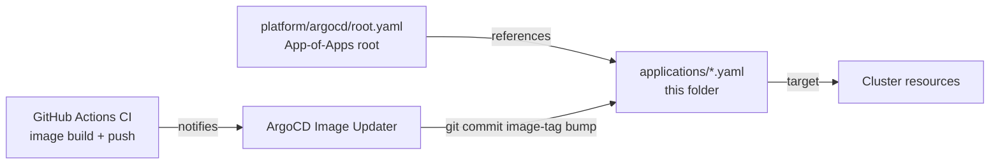

# ArgoCD Applications

App-of-Apps children. Each YAML manifest in this folder defines one ArgoCD `Application` that targets a path under `platform/` or `services/`. ArgoCD Image Updater writes image-tag bumps here from CI per ADR-0008.

## References

- ArgoCD App-of-Apps pattern: https://argo-cd.readthedocs.io/en/stable/operator-manual/cluster-bootstrapping/
- Image Updater: https://argocd-image-updater.readthedocs.io/
- Decision rationale: `docs/adr/0008-cicd-github-actions-argocd.md`.
