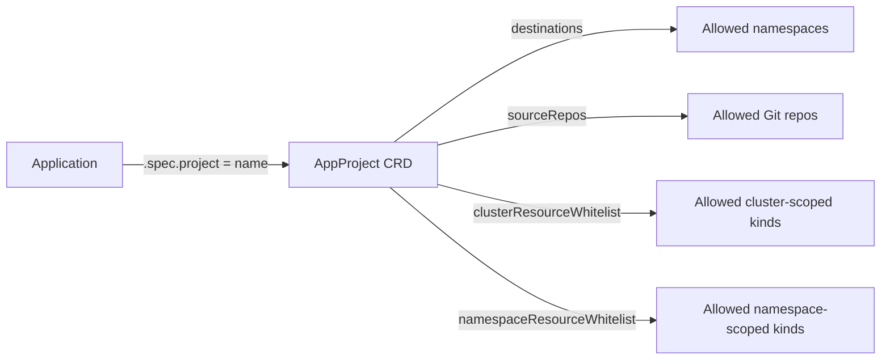

# ArgoCD AppProjects

AppProject definitions. One project per platform area (cluster, data-plane, observability, gateway, orchestration, governance, agent-runtime). Each project bounds the namespaces and resource kinds its Applications may touch — defense-in-depth alongside K8s RBAC.

## References

- ArgoCD Projects: https://argo-cd.readthedocs.io/en/stable/operator-manual/declarative-setup/#projects
- Decision rationale: `docs/adr/0008-cicd-github-actions-argocd.md`.
