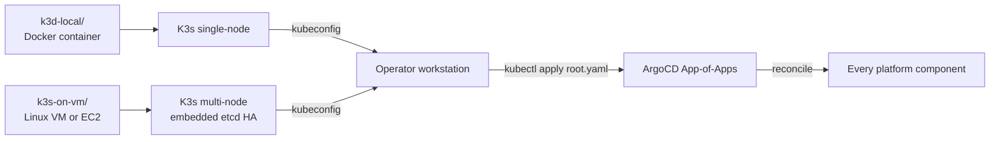

# platform/cluster/

K3s cluster definitions for the two target environments. K3s is the only substrate; there is no EKS option (see ADR-0010 — one stack per use case).

| Subdirectory | Environment | Notes |
|---|---|---|
| `k3d-local/` | Developer workstation | K3s inside Docker via k3d. Single node. Brought up by `make local-up`. |
| `k3s-on-vm/` | Staging and AWS production | K3s installed via the official script on Linux VMs or EC2. Multi-node cluster uses embedded etcd. AWS-specific cloud-init lives under `k3s-on-vm/aws/`. |

The platform manifests under `platform/L1-gateway/`, `platform/L2-orchestration/`, `platform/L4-data-plane/`, `platform/L6-governance/`, `platform/L7-observability/` are identical across both. The only differences are network topology and storage class wiring, which live in this folder.

## References

- K3s documentation: https://docs.k3s.io/
- K3s HA with embedded etcd: https://docs.k3s.io/datastore/ha-embedded
- k3d: https://k3d.io/
- Decision rationale: `docs/adr/0010-cluster-substrate-k3s.md`.
