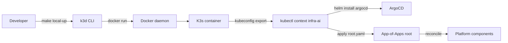

# K3d local cluster

Local development K3s cluster running inside Docker via k3d. Single node by default; Traefik disabled (Kong replaces it); local-path-provisioner for storage.

## Install and setup

Prerequisites:
- Docker Desktop (macOS / Windows) or Docker Engine (Linux).
- k3d CLI: `brew install k3d` (macOS) or `wget -q -O - https://raw.githubusercontent.com/k3d-io/k3d/main/install.sh | bash` (Linux).
- kubectl, helm.

Bring up:
```bash
make local-up
```

What `make local-up` does:
1. `k3d cluster create infra-ai --config platform/cluster/k3d-local/k3d-config.yaml`.
2. Installs ArgoCD via Helm (per `platform/argocd/README.md`).
3. Applies `platform/argocd/root.yaml`.
4. Waits for the App-of-Apps to converge.

Tear down: `make local-down` (runs `k3d cluster delete infra-ai`).

## Configuration

`k3d-config.yaml` defines:
- 1 server, 0 agents (single node).
- Traefik disabled.
- Port mapping `80:80@loadbalancer` and `443:443@loadbalancer` so Kong is reachable at `localhost`.
- Volume mount to `/var/lib/rancher/k3s/storage` for persistence across cluster restarts.

## Flow



## References

- k3d documentation: https://k3d.io/
- K3s documentation: https://docs.k3s.io/
- Decision rationale: `docs/adr/0010-cluster-substrate-k3s.md`

## Status

Configuration + Make target land at Stage 01.
