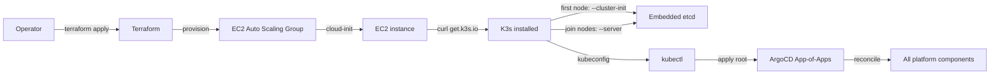

# K3s on VM (staging + AWS production)

K3s installed via the official script on Linux VMs. Used for staging (single VM or small VM cluster) and AWS production (EC2 Auto Scaling Group, multi-node).

## What this folder owns

- Ansible-style install scripts that wrap the official `https://get.k3s.io` script.
- An `aws/` overlay with:
  - Terraform for the VPC, security groups, ASG, EBS volumes.
  - cloud-init userdata that installs K3s, joins the cluster, and tags the node for Cube placement.
- Embedded etcd configuration (`--cluster-init` on first server; `--server` on additional servers).
- A CubeShim node-provisioning module for KVM-capable nodes (Stage 09).

## Install and setup

### Staging (single VM)

```bash
# On the VM
curl -sfL https://get.k3s.io | \
  INSTALL_K3S_VERSION="v1.30.x+k3s1" \
  K3S_TOKEN="<shared-token>" \
  sh -s - server \
    --disable=traefik \
    --cluster-init

# Export kubeconfig from /etc/rancher/k3s/k3s.yaml on the VM to the operator's workstation.
```

### AWS production

```bash
cd platform/cluster/k3s-on-vm/aws/terraform
terraform init
terraform apply
# ASG launches EC2 instances; cloud-init installs K3s; first node initialises etcd, others join.
```

Then install ArgoCD on the cluster:

```bash
kubectl apply -f platform/argocd/root.yaml
```

## Flow



## References

- K3s install documentation: https://docs.k3s.io/installation
- K3s HA with embedded etcd: https://docs.k3s.io/datastore/ha-embedded
- K3s on AWS production guides (referenced for cloud-init patterns).
- Decision rationale: `docs/adr/0010-cluster-substrate-k3s.md`

## Status

Manifests + Terraform land at Stage 01 (staging) and Stage 14 (AWS).
