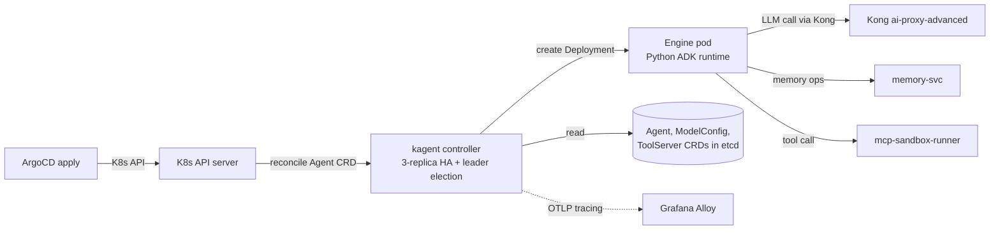

# kagent base installation

The CNCF Sandbox kagent project, installed as the platform's L3 agentic substrate. Per ADR-0011, we run **only the Python ADK runtime** (no Go ADK).

## What this folder owns

- `values.yaml` for the kagent Helm release with:
  - `controller.replicaCount: 3` + `leaderElection.enabled: true` (HA).
  - `engine.runtime: python-adk` (only).
  - `memory.enabled: false` (we use `memory-svc`, ADR-0004).
  - `kgateway.enabled: false` (we use Kong, ADR-0012).
  - `tracing.otlp.endpoint: alloy.ai-observability:4317`.
- One placeholder `Agent` CRD that proves the reconciliation loop end-to-end.
- One placeholder `ToolServer` CRD that proves the tool registration path.
- RBAC bindings so workload namespaces can apply Agent CRDs scoped to themselves.

## Install and setup

```bash
helm repo add kagent https://kagent.dev/charts
helm repo update

helm upgrade --install kagent kagent/kagent \
  --version x.y.z \
  --namespace kagent-system \
  --create-namespace \
  --values platform/kagent-base/values.yaml
```

Reconciled by ArgoCD in production.

## Flow



## References

- kagent project site: https://kagent.dev
- kagent docs: https://kagent.dev/docs/
- kagent architecture (Python ADK / Go ADK runtimes): https://kagent.dev/docs/kagent/concepts/architecture
- kagent GitHub: https://github.com/kagent-dev/kagent
- CNCF Sandbox project page: https://www.cncf.io/projects/kagent/
- Decision rationale: `docs/adr/0011-base-platform-kagent.md`

## Status

Helm install lands at Stage 06.
