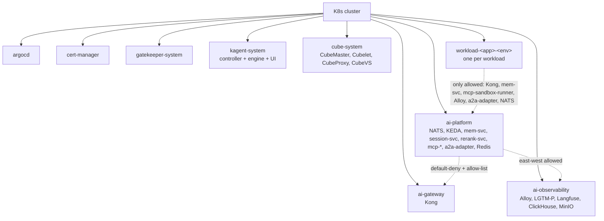

# Platform namespaces

The canonical namespace list, with NetworkPolicies and per-namespace conventions.

## Topology




## Namespaces

| Namespace | Purpose | NetworkPolicy default |
|---|---|---|
| `argocd` | ArgoCD controller + UI | allow K8s API only |
| `cert-manager` | cert-manager controller | allow ACME egress |
| `gatekeeper-system` | OPA Gatekeeper | allow K8s API only |
| `ai-gateway` | Kong AI Gateway pods | deny by default; allow LLM egress to allowlisted providers; allow ingress from outside |
| `ai-platform` | NATS, KEDA, memory-svc, session-svc, rerank-svc, mcp-registry, mcp-sandbox-runner, a2a-adapter, platform Redis | deny by default; allow east-west to declared peers |
| `ai-observability` | Alloy, Mimir, Loki, Tempo, Pyroscope, Grafana, Langfuse, ClickHouse, MinIO | deny by default; allow OTLP ingress, allow read from Grafana to backends |
| `kagent-system` | kagent controller + engine + UI | deny by default; allow K8s API, allow Alloy egress |
| `cube-system` | CubeMaster, Cubelet, CubeProxy, CubeVS | deny by default; allow E2B API ingress from mcp-sandbox-runner only |
| `workload-<app>-<env>` | One per workload | deny by default; allow only Kong, memory-svc, mcp-sandbox-runner, alloy, a2a-adapter, NATS |

## Why explicit namespace boundaries

Per-app isolation (ADR principle replacing "tenancy"). Default-deny is enforced via NetworkPolicy and validated at admission via OPA Gatekeeper's `RequireNetworkPolicy` constraint.

## Install and setup

```bash
kubectl apply -f platform/namespaces/
```

This applies:
- Namespace manifests with platform labels.
- Default-deny NetworkPolicies per namespace.
- Allow-list NetworkPolicies for the documented edges.

Reconciled by ArgoCD.

## References

- Kubernetes NetworkPolicy: https://kubernetes.io/docs/concepts/services-networking/network-policies/
- Layer specification (L6 enforcement): `docs/layers/L6-safety-policy-governance/README.md`

## Status

Namespaces land at Stage 01; per-workload `workload-<app>-<env>` is created per-workload at deploy time.
