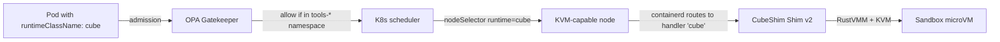

# RuntimeClass definitions

The only non-default container runtime registered in the cluster: `cube` (CubeSandbox via CubeShim). See ADR-0009.

## What it owns

- `RuntimeClass cube` resource pointing at handler `cube`, which containerd routes to the CubeShim Shim v2 binary on KVM-capable nodes.
- A nodeSelector constraint (`runtime=cube`) so that pods using `runtimeClassName: cube` only schedule onto KVM hosts.

## Why one RuntimeClass

We do not register Kata, gVisor, or other alternative runtimes. CubeSandbox is the only sandboxed runtime per ADR-0005 / ADR-0009.

## Install and setup

```bash
# Prereq: CubeShim binary installed on KVM-capable nodes via the Stage 09 node-provisioning script.
kubectl apply -f platform/runtime-classes/cube.yaml
```

Reconciled by ArgoCD.

## Flow



## References

- Kubernetes RuntimeClass docs: https://kubernetes.io/docs/concepts/containers/runtime-class/
- CubeSandbox architecture: https://github.com/TencentCloud/CubeSandbox/blob/master/docs/architecture/overview.md
- Decision rationale: `docs/adr/0009-runtime-class-cube.md`

## Status

RuntimeClass registration + node provisioning lands at Stage 09.
